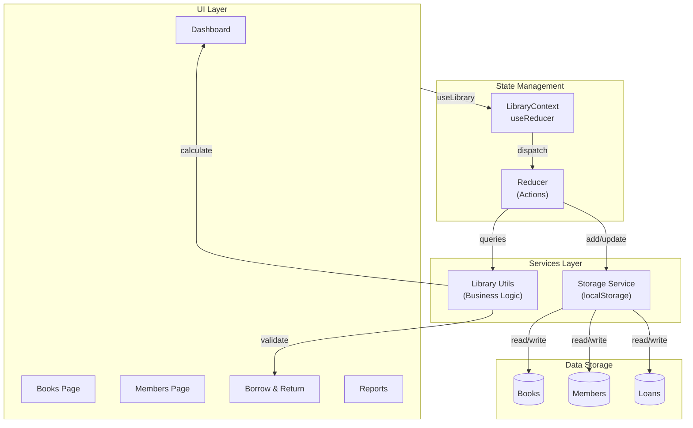
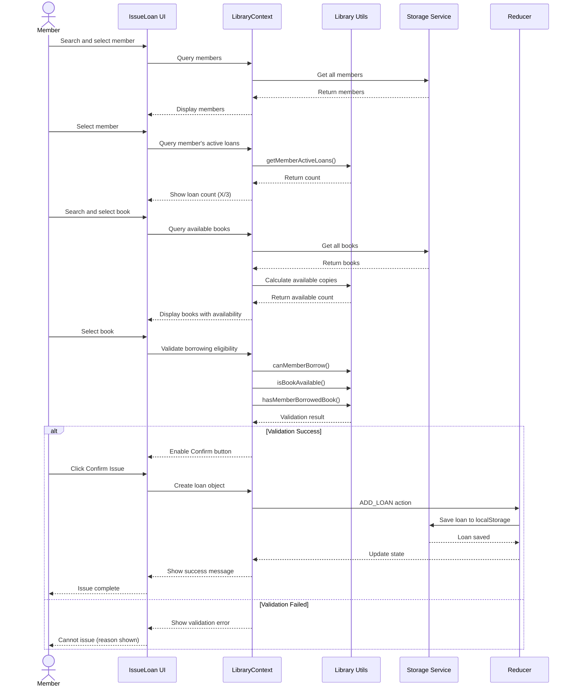
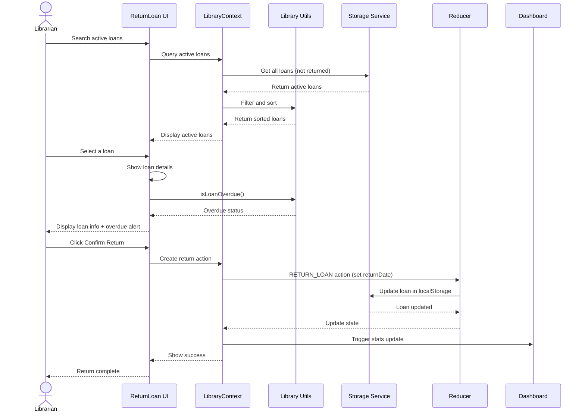
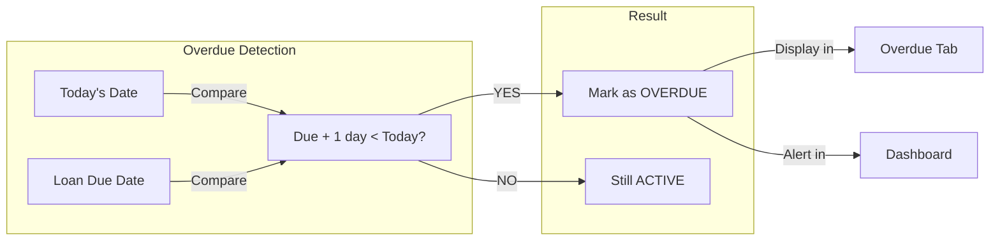
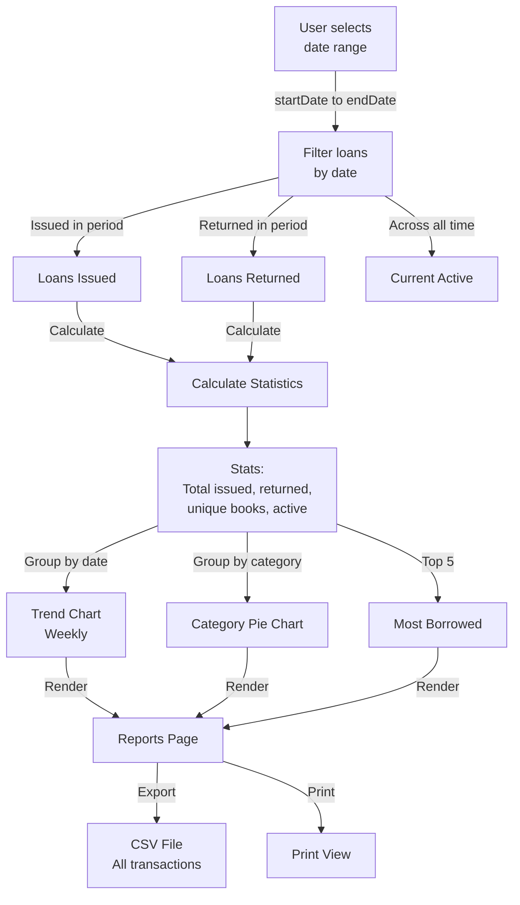
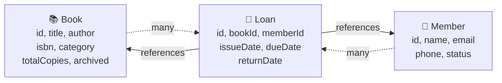
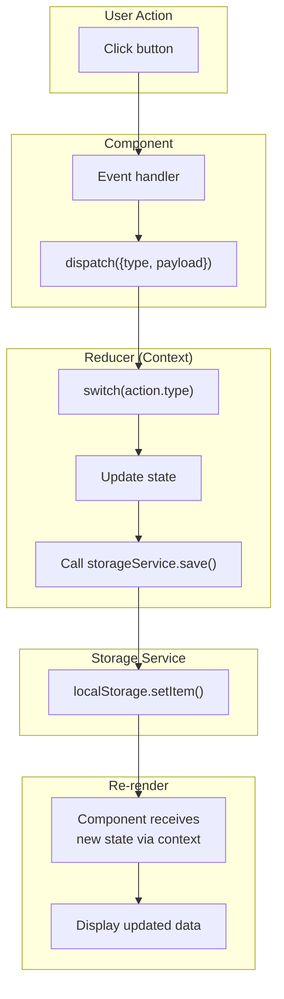
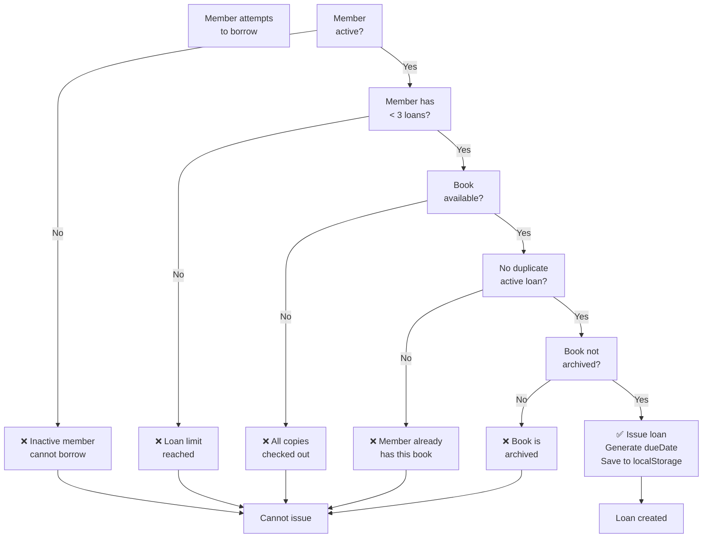

# BookNest Application Workflow

This document describes the key workflows and data flow in BookNest using a Mermaid diagram.

## System Architecture



## Workflow: Issue a Book



## Workflow: Return a Book



## Workflow: Track Overdue Loans



## Workflow: Generate Reports



## Data Relationships



## State Update Flow



## Example: Adding a Book

Step-by-step execution:

```
1. User fills BookForm
   - Validates inputs (non-empty, unique ISBN)
   - Checks existing books for ISBN conflicts
   
2. User clicks "Add Book"
   - Component calls addBook() from useLibrary()
   
3. addBook() dispatches ADD_BOOK action
   - Payload: { id, title, author, isbn, ... }
   
4. Reducer handles ADD_BOOK:
   - Creates new books array: [...books, newBook]
   - Calls storageService.saveBooks(newBooks)
   
5. Storage Service:
   - localStorage.setItem('booknest_books', JSON.stringify(newBooks))
   
6. Reducer updates context state:
   - state.books = newBooks
   
7. All subscribed components re-render:
   - Books.jsx gets new books list
   - Dashboard re-calculates statistics
   - Reports data updates
   
8. UI shows success message
   - Modal closes
   - Books table refreshes
```

## Borrowing Rules Implementation



## Date Handling

All dates are in `YYYY-MM-DD` format, using browser's local timezone:

```javascript
issueDate: "2026-08-31"      // Today
dueDate: "2026-09-14"        // 14 days later
returnDate: null             // Not yet returned
isOverdue: true              // If today > dueDate + 1 day
```

**No timezone conversion is performed** - all times are browser-local for simplicity in classroom setting.

---

*For more details, see README.md and CONTRIBUTING.md*
